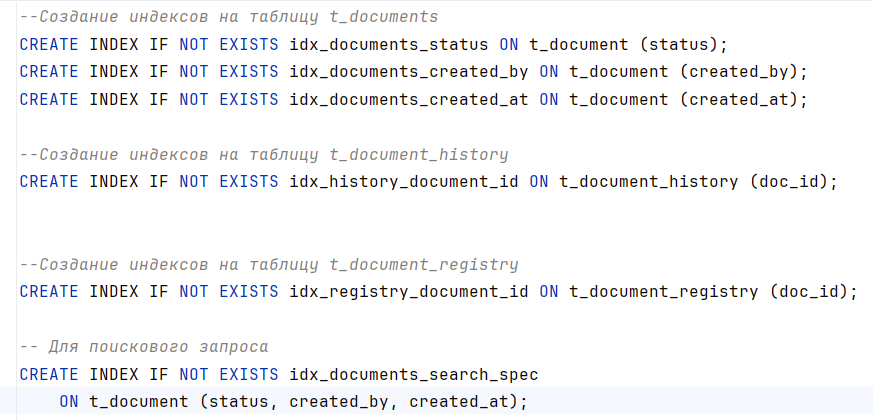

# АНАЛИЗ ЗАПРОСА НА ПОИСК ПО ФИЛЬТРАМ

##### Запрос на поиск
```
SELECT
    d1_0.id,
    d1_0.created_at,
    d1_0.created_by,
    d1_0.document_number,
    d1_0.status,
    d1_0.title,
    d1_0.updated_at
FROM
    t_document d1_0
WHERE
    d1_0.status = 'DRAFT'
    AND d1_0.created_by = 'd3b07384-d9a5-4b0e-9b5e-2c5b1e5c5c5c'
    AND d1_0.created_at >= '2024-01-01T00:00:00'
    AND d1_0.created_at <= '2024-01-31T23:59:59' 
ORDER BY
    d1_0.created_at
OFFSET 0 ROWS
FETCH FIRST 20 ROWS ONLY;
``` 
* Задаваемый период дат применяется к полю **created_at**

#### План выполнения запроса
```
Limit  (cost=0.14..8.17 rows=1 width=654) (actual time=0.020..0.021 rows=0.00 loops=1)
 Buffers: shared hit=2
 ->  Index Scan using idx_documents_search_spec on t_document d1_0  (cost=0.14..8.17 rows=1 width=654) (actual time=0.019..0.019 rows=0.00 loops=1)
     Index Cond: (((status)::text = 'DRAFT'::text) AND (created_by = 'd3b07384-d9a5-4b0e-9b5e-2c5b1e5c5c5c'::uuid) AND (created_at >= '2024-01-01 00:00:00+03'::timestamp with time zone) AND (created_at <= '2024-01-31 23:59:59+03'::timestamp with time zone))
     Index Searches: 1
     Buffers: shared hit=2
Planning:
 Buffers: shared hit=6
Planning Time: 0.199 ms
Execution Time: 0.045 ms
```

#### Индексы



1) idx_documents_status - Быстрый поиск (без полного сканирования таблицы) документов по его статусу;
2) idx_documents_created_by - Быстрый поиск всех записей, созданных конкретным пользователем.
3) idx_documents_created_at - Позволяет быстро находить документы, созданные в определённый период.

4) idx_documents_search_spec - Составной индекс, который будет применен для поиска записи, если в условии поиска
будут заданы все 3 аттрибута: status, created_by и created_at. В противном случае - применяются одиночные индексы.

5) idx_history_document_id - Оптимизированный поиск записей истории смены статусов по конкретному докумету


