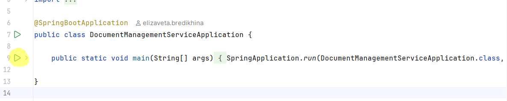

# Document Management Service

```
Разработан Backend-сервис по работе c документами.
Документы создаются, переводятся по статусам (DRAFT → SUBMITTED → APPROVED), по изменениям статуса ведётся
история. При переводе документа в статус APPROVED создается запись в реестре утверждений. 
Дополнительно создана утилита для массового создания документов (утилита реализована в рамках этого же микросервиса, отдельным API )
Также, реализована фоновая обработка документов пачками.
```
## Стек

```
Java 17 + Spring Boot
PostgreSQL 16 (Docker Compose)
JPA/Hibernate, 
Liquibase, 
Maven,
Testcontainers для интеграционных тестов
```
## Запуск приложения и его компонентов 
```
1. Реляционная бд PostgreSQL

- Запустить Docker
- выполнить в терминале IntelliJ IDEA команду: docker compose up -d --build

2. Сам backend-микросервис (запуск кнопкой Run)

```