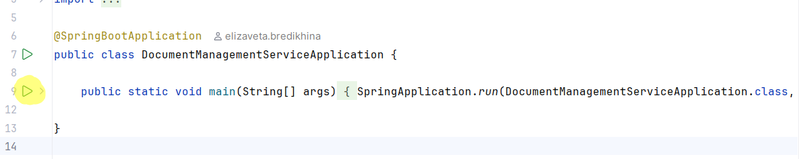

# Document Management Service

```
Разработан Backend-сервис по работе c документами.
Документы создаются, переводятся по статусам (DRAFT → SUBMITTED → APPROVED), по изменениям статуса ведётся
история. При переводе документа в статус APPROVED создается запись в реестре утверждений. 
Дополнительно создана утилита для массового создания документов (утилита реализована в рамках этого же микросервиса, отдельным API )
Также, реализована фоновая обработка документов пачками.
```
## Стек

```
Java 17 + Spring Boot
PostgreSQL 16 (Docker Compose)
JPA/Hibernate, 
Liquibase, 
Maven,
Testcontainers для интеграционных тестов`
```

## Запуск приложения и его компонентов 

```
1. Реляционная бд PostgreSQL

- Запустить Docker
- выполнить в терминале IntelliJ IDEA команду: docker compose up -d --build

2. Сам backend-микросервис (запуск кнопкой Run)
```


Сервис стартует на http://localhost:8083.
Liquibase автоматически накатывает скрипты миграции (схема бд, реляционное представление сущностей JPA)

## Утилита генерации документов

Утилита реализована отдельным API в рамках текущего микросервиса.
Для того, чтобы воспользоваться автоматической генерацией документов, нужно отправить запрос:

`
POST http://localhost:8083/api/utils/generate-documents
`
Размер батча задан в application.properties файле и его можно переопределить:
`
util.generate-document.batch-size=100
`

## Фоновые процессы (шедуллеры)

В сервисе есть две джобы, которые запускаются при старте сервиса.
```
SubmitWorker каждые 10 сек находит документы DRAFT и переводит их в SUBMITTED
ApproveWorker каждые 10 сек находит документы SUBMITTED и переводит в APPROVED
```

Периодичность запуска шедуллеров - это настраиваемый параметр, который задется в application.properties.
Также параметры настроек можно переопределить через environment переменные.

Настройка шедуллеров (service/src/main/resources/application.properties):
```
document.job.move-to-submitted.cron=0 0/10 * * * ?
document.job.move-to-approved.cron=0 0/10 * * * ?
document.job.move-to-submitted-batch-size=100
document.job.move-to-approved-batch-size=50
```

## Отслеживание по логам
```
 [http-nio-8083-exec-2] [c.i.d.c.DocumentUtilController] : Поступил запрос на генерацию документов >>>
 [http-nio-8083-exec-2] [c.i.d.a.DocumentProceedingAspect] : Метод generateDocuments начал свое выполнение в 2026-03-03T11:35:38.604Z >>>
 [http-nio-8083-exec-2] [c.i.d.service.DocumentUtilService] : Обработка запроса на генерацию 100 документов через утилиту >>>
 [http-nio-8083-exec-2] [c.i.d.service.DocumentUtilService] : Создаётся документ с названием "????????_"12b1922a-e351-4d3d-811b-a18a6cb03395 >>>
 [http-nio-8083-exec-2] [c.i.d.a.DocumentProceedingAspect] : Метод createDocument начал свое выполнение в 2026-03-03T11:35:38.622Z >>>
 [http-nio-8083-exec-2] [c.i.d.s.DocumentProcessingService] : Происходит создание документа c title "????????_"12b1922a-e351-4d3d-811b-a18a6cb03395 >>>
 [http-nio-8083-exec-2] [c.i.d.s.DocumentProcessingService] : Документ c title "????????_"12b1922a-e351-4d3d-811b-a18a6cb03395 и documentNumber b27fc769-b755-42a6-b20d-f9fcc6ef1590 успешно создан >>>
 [http-nio-8083-exec-2] [c.i.d.a.DocumentProceedingAspect] : Метод createDocument закончил свое выполнение в 2026-03-03T11:35:38.781Z >>>
 [http-nio-8083-exec-2] [c.i.d.a.DocumentProceedingAspect] : Метод createDocument выполнен за 159 мс >>>
 [http-nio-8083-exec-2] [c.i.d.l.DocumentStatusChangingListener] : Осуществляется сохранение истории по смене статуса по документу с title "????????_"12b1922a-e351-4d3d-811b-a18a6cb03395 и documentNumber b27fc769-b755-42a6-b20d-f9fcc6ef1590 >>>
 [http-nio-8083-exec-2] [c.i.d.l.DocumentStatusChangingListener] : История по смене статуса документа с documentNumber Document(id=201, documentNumber=b27fc769-b755-42a6-b20d-f9fcc6ef1590, createdBy=eeb0311f-4074-452c-a68b-b2faaf093423, title="????????_"12b1922a-e351-4d3d-811b-a18a6cb03395, status=DRAFT, createdAt=2026-03-03T14:35:38.686312, updatedAt=2026-03-03T14:35:38.686312) успешно сохранена >>>

 [http-nio-8083-exec-2] [c.i.d.service.DocumentUtilService] : Создаётся документ с названием "????????_"7455da44-5cd7-47a9-bf2d-2cdb055a8a64 >>>
 [http-nio-8083-exec-2] [c.i.d.a.DocumentProceedingAspect] : Метод createDocument начал свое выполнение в 2026-03-03T11:35:38.862Z >>>
 [http-nio-8083-exec-2] [c.i.d.s.DocumentProcessingService] : Происходит создание документа c title "????????_"7455da44-5cd7-47a9-bf2d-2cdb055a8a64 >>>
 [http-nio-8083-exec-2] [c.i.d.s.DocumentProcessingService] : Документ c title "????????_"7455da44-5cd7-47a9-bf2d-2cdb055a8a64 и documentNumber 3ee8c493-bf45-49f7-abe4-4c801d4af60d успешно создан >>>
 [http-nio-8083-exec-2] [c.i.d.a.DocumentProceedingAspect] : Метод createDocument закончил свое выполнение в 2026-03-03T11:35:38.869Z >>>
 [http-nio-8083-exec-2] [c.i.d.a.DocumentProceedingAspect] : Метод createDocument выполнен за 7 мс >>>
 [http-nio-8083-exec-2] [c.i.d.l.DocumentStatusChangingListener] : Осуществляется сохранение истории по смене статуса по документу с title "????????_"7455da44-5cd7-47a9-bf2d-2cdb055a8a64 и documentNumber 3ee8c493-bf45-49f7-abe4-4c801d4af60d >>>
 [http-nio-8083-exec-2] [c.i.d.l.DocumentStatusChangingListener] : История по смене статуса документа с documentNumber Document(id=202, documentNumber=3ee8c493-bf45-49f7-abe4-4c801d4af60d, createdBy=eeb0311f-4074-452c-a68b-b2faaf093423, title="????????_"7455da44-5cd7-47a9-bf2d-2cdb055a8a64, status=DRAFT, createdAt=2026-03-03T14:35:38.864105, updatedAt=2026-03-03T14:35:38.864661) успешно сохранена >>>
 ...
 ...
 [http-nio-8083-exec-2] [c.i.d.service.DocumentUtilService] : Создано 10 из 100 документов (10%) >>>
 [http-nio-8083-exec-2] [c.i.d.service.DocumentUtilService] : Создаётся документ с названием "????????_"3d081160-9220-46c3-827a-df696e2b1ddc >>>
 [http-nio-8083-exec-2] [c.i.d.a.DocumentProceedingAspect] : Метод createDocument начал свое выполнение в 2026-03-03T11:35:39.057Z >>>
 [http-nio-8083-exec-2] [c.i.d.s.DocumentProcessingService] : Происходит создание документа c title "????????_"3d081160-9220-46c3-827a-df696e2b1ddc >>>
 ...
 [http-nio-8083-exec-2] [c.i.d.service.DocumentUtilService] : Создано 40 из 100 документов (40%) >>>
 ...
 [http-nio-8083-exec-2] [c.i.d.service.DocumentUtilService] : Создано 100 из 100 документов (100%) >>>
 [http-nio-8083-exec-2] [c.i.d.service.DocumentUtilService] : Обработка запроса на генерацию 100 документов через утилиту завершена, успешно создано 100 >>>
 [http-nio-8083-exec-2] [c.i.d.a.DocumentProceedingAspect] : Метод generateDocuments закончил свое выполнение в 2026-03-03T11:35:41.088Z >>>
 [http-nio-8083-exec-2] [c.i.d.a.DocumentProceedingAspect] : Метод generateDocuments выполнен за 2484 мс >>>
 ```

## Запуск тестов

Тесты интеграционные написаны с использованием Testcontainers. Перед запуском тестов Docker должен быть запущен.

Тесты написаны на все кейсы в соответсвии с ТЗ:
```
happy-path по одному документу, 
пакетный submit, 
пакетный approve с частичными результатами, 
откат approve при ошибке записи в реестр утверждений
```

## Пункт из тз про опциональные улучшения

Реестр утверждений в отдельной системе
```
1)  Вынести в отдельный HTTP-сервис, подключить кафка-брокер, настроить консьюмер в этом сервисе.
В сервисе document-management-service публиковать событие в kafka-брокер.
Настраиваем продюссера с acks=all, enable.idempotence=true.
Cоздаем таблицу outbox, в которую будем записывать сообщения для отправки в брокер.
В таблице также будем хранить уникальный idempotency key, который сами сгенерим.
Отдельным процессом (шедуллер) вычитваем ивенты из таблицы и  публикуем их в кафка-брокер.
На стороне консьюмера:
Консьюмер отправляет manual ack в случае успешного считывания сообщения из топика.
Сообщение считывается в inbox таблицу, в которой также будет указан idempotency key.

И на стороне консьмера, и на стороне продюссера при считывании и перед отправкой в брокер соответсвенно осуществляется проверка
по idempotency key на предмет того, не было ли сообщение уже обработано.

2) отдельная БД:
Вынести ApprovalRegistry в отдельный DataSource с собственным менеджером транзакций.
Использовать XA-транзакции (JTA/Atomikos) или паттерн Outbox — писать событие в ту же БД, что и документ, затем отдельным процессом отправлять в реестр.
```


 